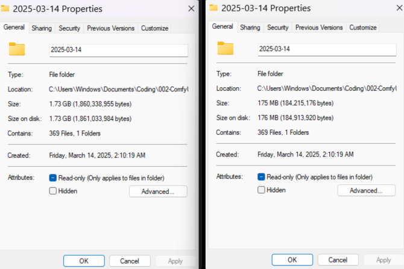

# Easy_image_compress

Easy_image_compress is a lightweight image compressor program to reduce the size of your images.

It uses Python utility like Pillow that compresses image files by reducing their dimensions (to 75% of the original) and convert them to JPEG format with little quality loss (90% quality).

Original files are safely moved to the Recycle Bin using the `send2trash` module.

As an example, you have a folder of 1.70 Gb with 300+ photos in of around 7.5 Mb each. In the end, you get a folder of 0.17 Gb (170 Mb), with pictures of 0.5 Mb. 
So you can store 10X more pictures / use 10 x less disc space. A good compromise optimization when one has a lot of picture to keep for archives. 

Yes, it decreasese the image size and quality. But most of the time, if these picture are for webpurpose, it won't be dramatic. 
---





## Simple Way to Use It (Standalone EXE)

### 1. Download the EXE
Download the standalone executable from this repository.

### 2. Place It in Your Folder containing the image to compress
Copy the downloaded EXE into the folder that contains the images you wish to compress. Note that it will compress all the images in this folder to the new lighter format and size and delete the original. Good practice : Create a folder where you place all the image you wish to compress then place the exe in it and run it. 

### 3. Run the EXE : DONE !
Double-click the EXE. The program will immediately display a message in the command prompt:

```
Easy_image_compress running
The old files will be moved to the Recycle Bin
```


The message stays visible for 2 seconds while the image processing starts concurrently.

The utility will then:
- Identify eligible image files (`.png`, `.jpg`, `.jpeg`) larger than **1 MB**.
- Resize them to **75%** of their original dimensions using **bicubic interpolation**.
- Save the new images as **JPEG (quality 90)** with an `_optim` suffix.
- Move the original files to the **Recycle Bin**.
- Once finished, the program prints a final message and exits automatically after a short delay.

---

## More complexe way to use : Using the Python Source Code

### 1. Installation

#### Clone the Repository
```bash
git clone https://github.com/yourusername/Easy_image_compress.git
cd Easy_image_compress
```

#### Install Dependencies

##### Requirements:
- **Python 3.x**
- **Pillow:** For image processing
- **Send2Trash:** To move original files to the Recycle Bin

##### Install via:
```bash
pip install pillow Send2Trash
```
Or using the requirements file:
```bash
pip install -r requirements.txt
```

---

## Usage

### Run as a Python Script
1. Place the `easy_image_compress.py` file in the folder with the images you want to compress.
2. Run the script from the command line started in your directory :
```bash
python easy_image_compress.py
```
Or by double-clicking the script (if configured to run with Python).


### This project includes the following third-party libraries: ###

- Pillow: Licensed under the MIT-CMU License. See [Pillow License](https://github.com/python-pillow/Pillow/blob/master/LICENSE).

- Send2Trash: Licensed under the BSD 3-Clause License. See [Send2Trash License](https://github.com/arsenetar/send2trash/blob/master/LICENSE).
